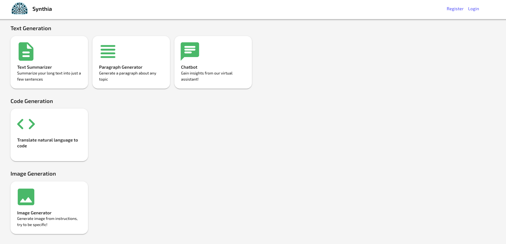

# Synthia

Using OpenAI api to generate text, code and images

## Preview



## Prerequisites

- ReactJS
- Material UI
- NodeJS(Express)
- Mongo

## Setup

- `git clone git@github.com:j33n/synthia.git`
- `yarn install`
- `cd client && yarn install`
- Create an environment variable file `config.env` and add the following values:
```python
PORT=4000
MONGO_URI=XXXXXX-XXXX
JWT_ACCESS_SECRET=myjwtaccesss3cr3t
JWT_ACCESS_EXPIRE=15min
JWT_REFRESH_SECRET=myjwtrefershs3cr3t
JWT_REFRESH_EXPIRE=30d
OPENAI_API_KEY=XXXXXX-XXXX
```

## TODO
- [ ] Code cleanup
- [ ] Improve UI/UX
- [ ] Protected routes
- [ ] Tests
- [ ] Stripe integratioon
- [ ] Support for dark mode
